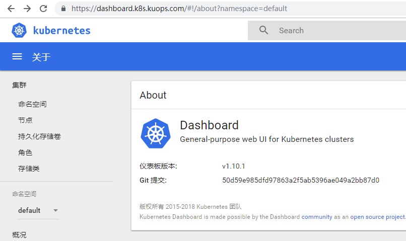

#  vagrant kubeadm all in one


## 前提条件
 
1. 安装 vagrant (wsl) 和 virtualbox

2. 安装 Windows WSL 

3. 开启 wsl vagrant , WSL vagrant 需要设置以下变量,加入 `~/.bashrc`

```
# Windows VBoxManage.exe 所在的安装目录
export PATH="$PATH:/mnt/c/Software/VirtualBox"
# 开启 WSL 使用 Vagrant 
export VAGRANT_WSL_ENABLE_WINDOWS_ACCESS="1" 
# 设定跳过权限检查的目录 
export VAGRANT_WSL_WINDOWS_ACCESS_USER_HOME_PATH=/mnt/d/
# 自定义 vagrant 的元数据存放目录
export VAGRANT_HOME=/mnt/d/vagrant-home/.vagrant.d/
```

4. 有一个购买的域名,并添加一条 A 记录 `*.k8s` 到 `10.0.7.100`

## 节点信息

单节点开发环境

|hostname|system|ip|
|---|---|---|
|vagrant-kubernetes|centos 7|10.0.7.100|


## 1. 启动

克隆代码

```
git clone https://github.com/kuops/vagrant-kubeadm.git
cd vagrant-kubeadm
```

在宿主机生成 ssh 密钥对 `vagrant_id_rsa` 和 `vagrant_id_rsa.pub` 并

```
mkdir -p ~/.ssh
ssh-keygen -t rsa -N "" -f mkdir -f ~/.ssh/vagrant_id_rsa
```

vagrant 安装插件

```
vagrant plugin install vagrant-scp vagrant-hostmanager --plugin-clean-sources --plugin-source https://gems.ruby-china.com/
```

下载 vbox 文件

```
curl -SLo /mnt/d/localrepo/CentOS-7-x86_64-Vagrant-1811_02.VirtualBox.box http://mirrors.ustc.edu.cn/centos-cloud/centos/7/vagrant/x86_64/images/CentOS-7-x86_64-Vagrant-1811_02.VirtualBox.box
```

修改 `centos-metadata.json` 中的 path 为下载的地址, 之后使用 add 命令添加 box

```
vagrant box add centos-metadata.json
```

验证是否添加成功, 此时会有一个 centos7 的 1811 版本的 box

```
$ vagrant box list
centos/7 (virtualbox, 1811.02)
```

启动 vagrant

```
vagrant up --provision
```

如果想在 WSL 中使用 kubectl

```
sudo scp -i ~/.ssh/vagrant_id_rsa vagrant@vagrant-kubernetes:/usr/bin/kubectl /usr/local/bin/
scp -rp -i ~/.ssh/vagrant_id_rsa vagrant@vagrant-kubernetes:~/.kube ~/.kube
PATH=$PATH
```

kubectl 命令补全

```
# zsh
source <(kubectl completion zsh)
# bash
source <(kubectl completion bash)
```

## 证书

由于使用的 IP 是私有地址，使用 `http-challenge` 方式不合适，使用 dns 的 txt 记录，cert-manager 不支持阿里云，这里使用 `acme.sh`,申请通配符证书 `*.k8s.yourdomain.com`。


```
# 进入虚拟机
vagrant ssh
# 安装
curl  https://get.acme.sh | sh

# 设置 alias
alias acme.sh=~/.acme.sh/acme.sh

# DNS API ，我这里使用阿里云的，阿里云 RAM 策略对应为 AliyunDNSFullAccess
# 其他的域名提供商请查看 https://github.com/Neilpang/acme.sh/blob/master/dnsapi/README.md
export Ali_Key="yourkey"
export Ali_Secret="yoursecret"

# 申请证书
acme.sh --issue --dns dns_ali -d *.k8s.youdomain.com

# 等待执行完毕之后,会看到文件的路径
[Sat Jan 12 01:12:55 CST 2019] Your cert is in ...
[Sat Jan 12 01:12:55 CST 2019] Your cert key is in ...
[Sat Jan 12 01:12:55 CST 2019] The intermediate CA cert is in ...
[Sat Jan 12 01:12:55 CST 2019] And the full chain certs is there: ...

# COPY 证书,安装到 `k8s-cert` 目录中,cert 证书使用的是 fullchain cert
sudo mkdir -p /data/k8s-cert
sudo chown -R vagrant.vagrant  /data/k8s-cert
acme.sh  --installcert  -d  *.k8s.yourdomain.com   \
        --key-file   /data/k8s-cert/k8s.yourdomain.com.key \
        --fullchain-file /data/k8s-cert/k8s.yourdoamin.com.crt

# 退出 
exit
```

将证书导出到外部

```
scp -rp -i ~/.ssh/vagrant_id_rsa vagrant@vagrant-kubernetes:/data/k8s-cert .
```

为 default namaspace 设置 tls secret ，所有部署在 default ns 的服务都可以使用

```
kubectl -n default create secret tls default-tls-certs \
  --key k8s-cert/k8s.yourdomain.com.key \
  --cert k8s-cert/k8s.yourdomain.com.crt
```

##  kubernetes 组件

### metallb

使本地的部署的 kubernetes 集群的 Service 可以使用  `loadbalancer` 类型 


部署使用的 layer2 类型，可用地址段为 `10.0.7.110-10.0.7.210`

```
kubectl apply -f metallb/metallb.yaml

kubectl apply -f metallb/configmap.yaml
```

### ingress

使用 kubernetes 官方的 nginx-ingress , 使用 daemonset 方式部署

```
kubectl apply -f nginx-ingress/mandatory.yaml
```

> 注意: dns 设置 A 记录指向 10.0.7.100 域名为 `*.k8s.yourdomain.com`


### Dashboard

dashboard 如果需要显示 metrics 图形，需要安装 heapster
metrics-server 在支持中 https://github.com/kubernetes/dashboard/issues/2986


创建证书的 secret , 如果在 WSL 中操作，参见步骤将证书导出

```
kubectl -n kube-system create secret tls kubernetes-dashboard-certs \
  --key k8s-cert/k8s.yourdomain.com.key \
  --cert k8s-cert/k8s.yourdomain.com.crt
```

当你拥有证书之后，安装 dashboard ,修改 `ingress.yaml` 文件中中的域名为自己的域名

```
kubectl apply -f dashboard/
```

获取管理员登陆 token

```
SECRET_NAME=$(kubectl -n kube-system  get serviceaccounts kubernetes-dashboard -o jsonpath='{.secrets[0].name}')
kubectl -n kube-system  get secrets ${SECRET_NAME} -o jsonpath='{.data.token}'|base64  -d
```

访问 dashboard




### StorageClass

storageclass 使用 NFS storageclas

```
kubectl apply -f storage-class/nfs/nfs.yaml
kubectl patch storageclass example-nfs -p '{"metadata": {"annotations":{"storageclass.kubernetes.io/is-default-class":"true"}}}'
```

验证 storageclass

```
kubectl apply -f - <<EOF
kind: PersistentVolumeClaim
apiVersion: v1
metadata:
  name: nfs
  annotations:
    volume.beta.kubernetes.io/storage-class: "example-nfs"
spec:
  accessModes:
    - ReadWriteMany
  resources:
    requests:
      storage: 1Mi
EOF

$ kubectl get pvc
NAME   STATUS   VOLUME                                     CAPACITY   ACCESS MODES   STORAGECLASS   AGE
nfs    Bound    pvc-e9d2f142-247b-11e9-abd0-5254008481d5   1Mi        RWX            example-nfs    3s
```

### Helm

安装 helm 命令 ，因为有可用 googleapis 访问不了，使用 docker 安装

```
kubectl apply -f helm/install.yaml
```

WSL 安装 helm 命令

```
sudo scp -i ~/.ssh/vagrant_id_rsa vagrant@vagrant-kubernetes:/usr/local/bin/helm /usr/local/bin/helm
PATH=$PATH
```

安装 tiller

```
kubectl  create  serviceaccount tiller -n kube-system

kubectl  create  clusterrolebinding tiller \
    --clusterrole=cluster-admin --serviceaccount=kube-system:tiller

helm init --upgrade --service-account tiller \
    --skip-refresh -i kuops/tiller:v2.12.1 \
    --stable-repo-url https://kuops.com/helm-charts-mirror

helm repo update
```

helm 命令补全

```
# bash 补全, zsh 有bug
source <(helm completion bash)
```

### EFK (可选)

创建 secret

```
kubectl -n kube-system create secret tls kibana-logging-certs \
  --key k8s-cert/k8s.yourdomain.com.key \
  --cert k8s-cert/k8s.yourdomain.com.crt
```

修改 `ingress.yaml`中的域名，安装 EFK

```
kubectl label nodes vagrant-kubernetes beta.kubernetes.io/fluentd-ds-ready=true
kubectl  apply  -f fluentd-elasticsearch
```

访问 `https://kibana.k8s.yourdomain.com`


### Prometheus (可选)

Prometheus 使用 coreos 的 kube-prometheus

创建 secret 

```
kubectl -n monitoring create secret tls kube-prometheus-certs \
  --key k8s-cert/k8s.yourdomain.com.key \
  --cert k8s-cert/k8s.yourdomain.com.crt
```

创建 kube-prometheus 资源

```
kubectl  apply  -f kube-prometheus/
```

访问地址:

```
https://grafana.yourdomain.com
https://prometheus.yourdomain.com
https://alertmanager.yourdomain.com
```

coredns 自带的 prometheus 中没有声明 metrics 的 port ，重新部署一下 service

```
kubectl apply -f coredns/service.yaml
```

监控 nginx-ingress , ingress 在不同的 ns 中，需要给 service account 授权:

```
kubectl apply -f nginx-ingress/servicemonitor.yaml
```

导入 nginx-ingress 的 grafana 模板

```
https://raw.githubusercontent.com/kubernetes/ingress-nginx/master/deploy/grafana/dashboards/nginx.json
```


### isio (可选)

安装 istioctl

```
kubectl apply -f istio/install.yaml
```

WSL 使用 istioctl

```
sudo scp -i ~/.ssh/vagrant_id_rsa vagrant@vagrant-kubernetes:/usr/local/bin/istioctl /usr/local/bin/istioctl
PATH=$PATH
```

安装 istio

```
kubectl create ns istio-system
kubectl apply -f istio/istio.yaml
```

此 istio 模板是由 helm 生成的,以下是选项参数

```
helm template istio-1.0.5/install/kubernetes/helm/istio --name istio \
    --namespace istio-system \
    --set global.mtls.enabled=true \
    --set tracing.enabled=true \
    --set servicegraph.enabled=true \
    --set grafana.enabled=true > istio.yaml
```

如果需要开启 sidecar 自动注入模式,将 default ns 设置 `istio-injection`

```
kubectl label namespace default istio-injection=enabled --overwrite
```

设置 ingress , 修改 `ingress.yaml` 中的域名为 `yourdomain.com`

```
kubectl -n istio-system create secret tls istio-tls-certs \
  --key k8s-cert/k8s.yourdomain.com.key \
  --cert k8s-cert/k8s.yourdomain.com.crt

kubectl apply -f istio/ingress.yaml
```

访问域名

```
https://jaeger-istio.k8s.yourdomain.com
https://prometheus-istio.k8s.yourdomain.com
https://grafana-istio.k8s.yourdomain.com
https://servicegraph-istio.k8s.yourdomain.com
```


